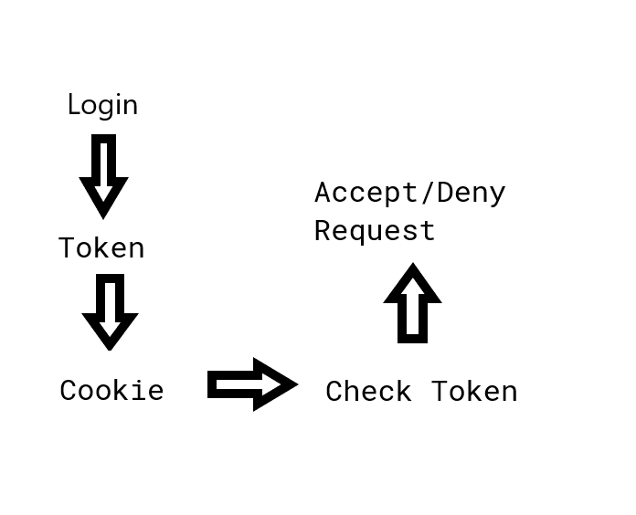

# DEZSYS_GK732_WINDPARK_REST

## Einfuehrung

Eine Windkraftanlage erzeugt Daten über die Stromerzeugung und den Umgebungsbedingungen in regelmaessigen Zeitabstaenden. Diese Daten sollen in einer standardisierten Form zur weiteren Verarbeitung zur Verfügung gestellt werden.

## Voraussetzungen

* Java Programmierkenntnisse
* Verwendung von Maven und Git
* Grundlagen Dezentrale Systeme
* Grundlagen zu XML, JSON & REST

## Aufgabenstellung

Entwickeln Sie einen Simulator der die Daten der Windkraftanlage generiert. Es ist dabei zu achten, dass die Daten realistisch sind und im Zusammenhang mit einer entsprechenden Einheit erzeugt werden. 

Die Daten der Windkraftanalage sollen ueber einer REST Schnittstelle veroeffentlicht werden. Die Schnittstelle verwendet standardmaessig das JSON Format und kann optional auf XML umgestellt werden.

Die Schnittstelle soll mit einer einfachen Applikation getestet werden. Dabei sollen die Daten mit Hilfe von HTML und JQuery "konsumiert" und in einer Tabelle dargestellt werden.

## Erweiterung

Die Daten sollen vor einem nicht autorisierten Zugriff geschützt werden. Entwerfen Sie und implementieren Sie ein Konzept, um die Datensicherheit zu gewährleisten.

## Aufbau der Applikation

- Windengine Simulation
- Windengine Interface
- Windengine Model (JSON Format)
- Controller receive HTTP requests
- Service contains business logic
- Controller publish windengine data requested by client
- Client consumes windengine data 

## Technologien

- Springboot
- Maven
- REST
- JSON
- jQuery

## Dokumente und Links

Spring Boot   
https://spring.io/projects/spring-boot

Building an Application with Spring Boot  
https://spring.io/guides/gs/spring-boot/

Spring Initializr  
https://start.spring.io/

Understanding REST  
https://spring.io/understanding/REST

Building a RESTful Web Service  
https://spring.io/guides/gs/rest-service/

Consuming a RESTful Web Service  
https://spring.io/guides/gs/consuming-rest/

Consuming a RESTful Web Service with jQuery
https://spring.io/guides/gs/consuming-rest-jquery/

## Bewertung

Gruppengroesse: 1 Person   
Anforderungen "ueberwiegend erfuellt"    

* Windengine Simulator
* Implementation der REST Schnittstelle
* Daten im JSON Format zur Verfuegung stellen
* Implementation eines "Consumer" und Darstellung der Daten in einer Tabelle
* Konzept fuer ein entsprechendes Sicherheitskonzept fuer die REST Schnittstelle

Anforderungen "zur Gaenze erfüllt"

* Daten im XML Format zur Verfuegung stellen
* Umsetzung eines Sicherheitskonzepts fuer die REST Schnittstelle


# Durchführung
Als erstes sollte man sich die Dokumentationen anschauen.
Vorallem die Documentation zu `@RequestMapping`.
Dort sieht man dann das man ein Argument `produces` setzen kann. Dies setzt in welchen Rückgabetypen 
Spring das Objekt Transformiert. Zum beispiel:
```java
@RequestMapping(value = "/windengine/{windengineID}/data/json", produces = "application/json")
```  
Dies setzt den ausgabe wert von dem endpoint /data/json auf `json`

Dannach habe ich das Verzeichnis `/public` erstellt um dort die öffentlichen Dateien zu speichern.
Dies mach ich damit ich nicht dauernd neue Endpoints konfigurieren muss oder die Dateien laden.  
In diesem Verzeichnis liegt die `index.html` wo die links zu den unterschiedliechen verzeichnissen liegen.  
Dort gibt es das Unterverzeichniss `jquery` wo die Dateien für den jQuery-Client liegen.  

Der JavaScript-Code ist da um die JSON Daten schön darzustellen.

## Authentication
Im nächsten schritt wollen wir ein Login einfügen.
Skizze:

Basisprinzip: Wenn beim Login der User und das Password übereinstimmen generieren wir einen Token,
welcher eine UUID ist, diesen senden wir dem Client mithilfe einen Cookies. Bei jeder Anfrage auf 
eine Sichere seite wird überprüft ob der Token in der Liste der erlaubten Tokens ist. Wenn dies nicht
der Fall ist senden wir einen 401 Unauthorized Fehler an den Client. Fals es den Token gibt senden wir
die Daten.

Es gibt auch eine /logout Seite, diese Löscht einfach nur den Token aus der Liste der Erlaubten Tokens 
gelöscht und somit die weiteren Anfragen gestopt.

Derzeit ist die Abfrage ob das Password richtig ist einfach nur ob es gleich mit dem Nutzernamen ist.
In der zukunft kann man natürlich stärkere methoden wählen. Mann sollte das verfahren mit unverschlüsselten
cookies *nicht* ohne https verwenden.
